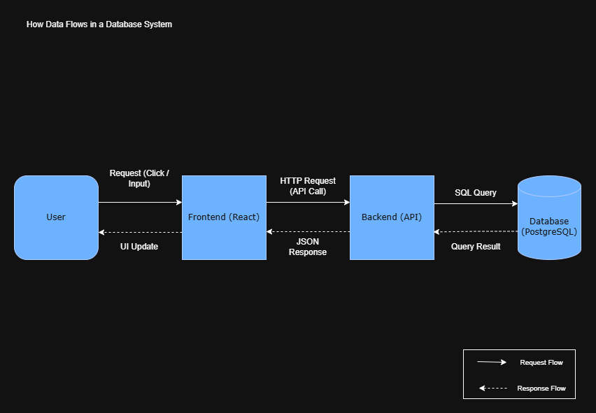

# What is a Database?

A database is an organized collection of data that is stored, managed, and easily accessed electronically.

Think of it like a digital warehouse where information is stored in a structured way so it can be retrieved, updated, and managed efficiently

---

## Key Concepts

### Data vs Database vs DBMS

| Term                              | Meaning                                          |
|-----------------------------------|--------------------------------------------------|
| Data                              | Raw facts (e.g., names, numbers, transactions)   |
| Database                          | A structured collection of data                  |
| DBMS (Database Management System) | Software used to interact with the database      |

Example:
- Data -> `"Ayodele", 5000, "Lagos"`
- Database -> A table storing many users and balances
- DBMS -> PostgreSQL, MySQL, MongoDB

---

## Why Do Databases Exist?

Before databases, systems used file storage (e.g., JSON, CSV, text files).

### Problems with File Storage:
- Data duplication (same data repeated)
- No relationships between data
- Difficult to query (no powerful search)
- Poor scalability
- High risk of data inconsistency
- No concurrency control (multiple users cause issues)

### Databases Solve This:
- Structured storage (tables, documents)
- Efficient querying (SQL)
- Data integrity and consistency
- Concurrency handling
- Scalability for large systems

---

## Real-World Examples

### Banking System
- Stores:
    - Users
    - Accounts
    - Transactions

- Example:
    - Transfer 5000 naira -> database updates balances safely

---

### E-commerce Platform
- Stores:
    - Products
    - Users
    - Orders

- Example:
    - User buys an item -> database
        - deducts stock
        - creates order record
        - tracks payment

---

## How Databases Are Used in Systems

In a typical application:

The database is the source of truth.
